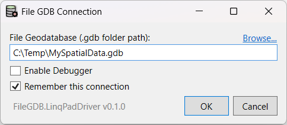
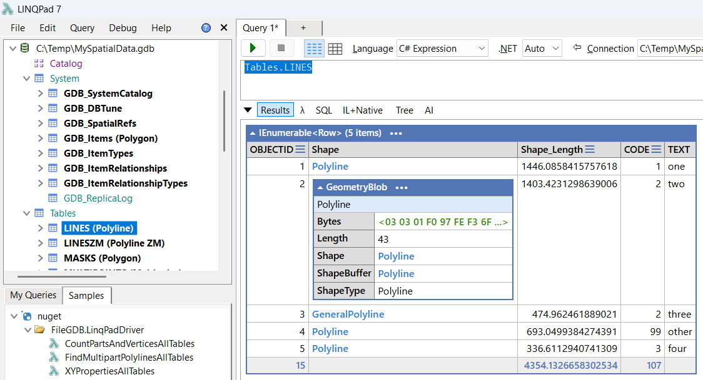

# FileGDB Driver for LINQPad

This repository contains the source code of a read-only library
to access an Esri File Geodatabase (also known as a File GDB or
an FGDB), and a driver for [LINQPad][linqpad] that uses this library.
Both are written in C# with no dependencies beyond .NET.

Consult the README files in the respective project folders,
and see the doc folder for technical information:

- Reading the File Geodatabase: [src/FileGDB.Core](src/FileGDB.Core/README.md)
- Driver for LINQPad: [src/FileGDB.LinqPadDriver](src/FileGDB.LinqPadDriver/README.md)
- About the File Geodatabase: [doc/FileGDB.md](doc/FileGDB.md)

[linqpad]: https://linqpad.net

## Screenshots

  
The connection dialog: enter (or browse to) the path to a File GDB's *.gdb* folder.

  
Both system and user tables appear in LINQPad's tree view.
Drag any table to the query window and run the query.
Click the shape links to “drill down” into the geometry.
