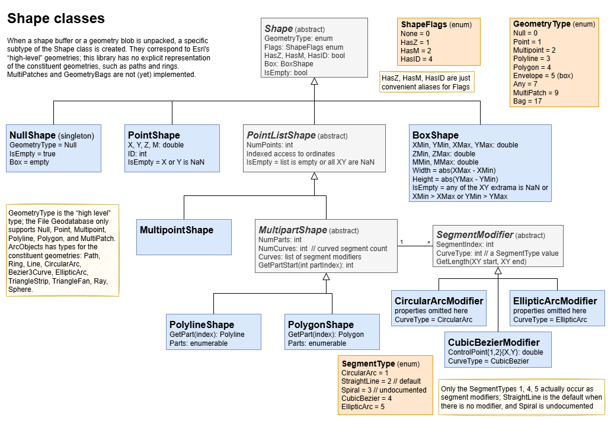

# Developer Notes

## LINQPad

Documentation about writing a custom data context driver for LINQPad:  
<https://www.linqpad.net/Extensibility.aspx>

LINQPad caches drivers in `%LocalAppData%\LINQPad\Drivers\DataContext`
and NuGet drivers in `%LocalAppData%\LINQPad\NuGet.Drivers`. LINQPad
also uses the Windows NuGet cache in `%UserProfile%\.nuget\packages`.
During development it may be useful to remove the driver from any or
all of these locations.

A driver deployed as a NuGet package can **include samples** that LINQPad
will show on its Samples tab: simply add `*.linq` files (stored LINQPad
queries) in a top-level `linqpad-samples` folder to the NuGet package and
the `linqpad-samples` package tag to its metadata.
Documentation is at <https://www.linqpad.net/nugetsamples.aspx>.
In the `.csproj` it could look like this:

```xml
...
<PackageTags>linqpaddriver;linqpad-samples;...</PackageTags>
...
<None Include="linqpad-samples/*.linq" Pack="True" PackagePath="linqpad-samples" />
...
```

## NuGet

Including symbols with NuGet:  
<https://learn.microsoft.com/en-us/nuget/create-packages/symbol-packages-snupkg>

Including a README in NuGet:  
<https://devblogs.microsoft.com/nuget/add-a-readme-to-your-nuget-package/>

NuGet has a test instance (packages not preserved)
at <https://int.nugettest.org/> with feed URL
<https://apiint.nugettest.org/v3/index.json>

## Geometry and Shapes

When a geometry blob is unpacked, it is represented as a subtype
of the abstract `Shape` class. The shape class hierarchy is shown
below (source in [Diagram.drawio](./Diagram.drawio)):



## Basic Geometry Operations

Assuming only linear segments and polygons without self-intersections:

Op.     |Empty|Point $p$|Multipoint $m$| Polyline    | Polygon
--------|:---:|:-------:|:------------:|:-----------:|:-------:
Length  |  0  |    0    | 0            |sum(len(seg))|sum(len(seg))
Area    |  0  |    0    | 0            | 0           | (1)
Centroid|empty|   $p$   |mean($p\in m$)| (2)         | (3)
Boundary|empty|  empty  |empty         |endpoints (4)| (5)

(1) Area of a simple polygon: use the “shoelace formula”, that is:  
$A={1\over2}\sum(x_i y_{i+1} - x_{i+1} y_i)$
with $x_n=x_0$ and $y_n=y_0$

(2) Centroid of a polyline:
length-weighted mean of the segment midpoints

(3) Centroid $C$ of a polygon: with $A$ the area as shown above,  
$C_x = {1\over 6A}\sum(x_i+x_{i+1})(x_i y_{i+1} - x_{i+1}y_i)$ and  
$C_y = {1\over 6A}\sum(y_i+y_{i+1})(x_i y_{i+1} - x_{i+1}y_i)$  .

(4) The set of endpoints of each line string, with coincident
points that occur an even number of times removed (referred to
as the “mod 2 union rule” in the OGC Simple Features Specification);
thus a closed ring has and empty boundary, a triple junction
has 4 (!) “endpoints”, while a quadruple junction also has 4
endpoints (the one in the middle occurs 4 times and is removed).

(5) The set of rings (inner and outer) that define the polygon.

Sample code to compute area and centroid of a polygon using
the formulas above:

```C
typedef struct { double x, y; } Point;

double
PolygonAreaCentroid(Point *polygon, int N, Point *centroid)
{
  double signed_area = 0;
  double cx = 0, cy = 0;
  for (int i = 0; i < N; i++) {
    Point p = polygon[i];
    Point q = polygon[(i+1)%N];
    double a = p.x * q.y - q.x * p.y;
    signed_area += a;
    cx += (p.x + q.x) * a;
    cy += (p.y + q.y) * a;
  }
  signed_area /= 2;
  centroid->x = cx / 6 / signed_area;
  centroid->y = cy / 6 / signed_area;
  return signed_area < 0 ? -signed_area : signed_area;
}

double area;
Point centroid, polygon[] = {{0,0}, {1,1}, {1,0}};
area = PolygonAreaCentroid(polygon, 3, &centroid);
// expect area = 0.5, centroid = 0.6666, 0.3333
```

References

- About area and centroid of a polygon, see the short article
  *Calculating the area and centroid of a polygon* by Paul Bourke
  at <https://paulbourke.net/geometry/polygonmesh/>
- The shoelace formula is illustrated on Wikipedia at
  <https://en.wikipedia.org/wiki/Shoelace_formula>
- The OGC Simple Features Specification available at
  <http://www.opengis.net/doc/is/sfa/1.2.1>
